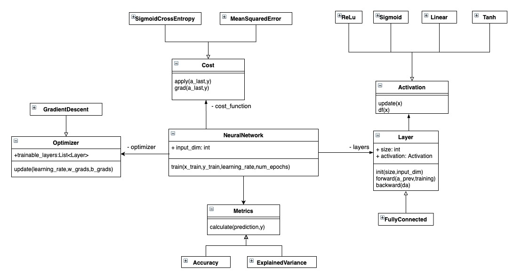

# Framework_TDIA

## Computación Neuronal
    
 Este componente ofrece la implementación de una red neuronal
 (*feedforward neural network*)
 
### Diagrama de clases

A continuación se presenta el diagrama de clases correspondiente

